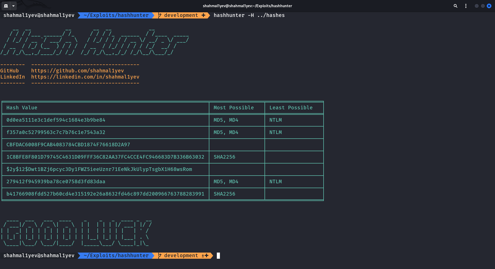

# Hash Hunter (hash-identifier)

HashHunter is a Python tool that identifies hashes from a wordlist, integrating with HashCat.



### Who is it for?

- Ideal for cybersecurity professionals who want to analyze hash types.
- Suitable for anyone who wants to analyze hash lists quickly and easily.
- Anyone looking to better understand and analyze hash types can benefit from this tool.

### New Feature: Hash List Upload

HashHunter's newest feature allows users to directly upload a hash list to the tool. This feature groups hash lists into different files, making them suitable for use with hashcat.

### Usage

- Identify hash values from a specified file and save only the most possible hash groups:

```shell
hashunter -H path/to/hash_list.txt --group
```

- Identify hash values from a specified file and save both the most and least possible hash groups:

```shell
hashunter -H path/to/hash_list.txt --group -a
```

- Identify hash values from a specified file and save all output to a file:

```shell
hashunter -H path/to/hash_list.txt -pO path/to/output.txt
```

### Parameters

| Parameter          | Shortcut | Description                                                                       |
|--------------------|----------|-----------------------------------------------------------------------------------|
|                    | **-H**   | Path to the file containing hashes to identify. Required parameter.               |
| **--plain-output** | **-pO**  | Used to save all output to a file.                                                |
| **--group**        | **-g**   | Used to group hash values and save them with names based on HashCat's hash modes. |
| **--all**          | **-a**   | Used to save both most and least hash groups.                                     |

### Supported Algorithms

- MD4
- MD5
- SHA2-256
- NTLM

### Authors

- [@shahmal1yev](https://www.github.com/shahmal1yev)
- [@blackploit](https://www.github.com/blackploit)

